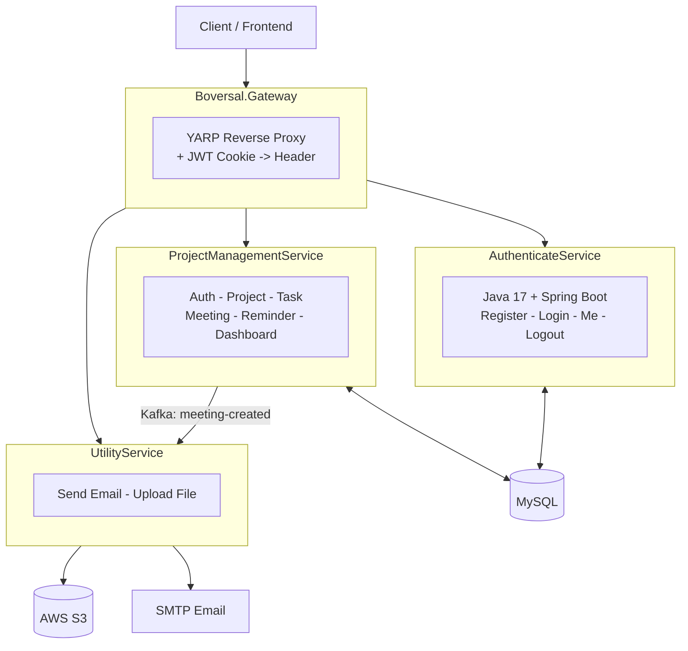

# Boversal Backend

### Project & Task Management System — Microservices Architecture

---

## What does this project do?

**Boversal** is the backend for a platform similar to a lightweight **Trello + Google Calendar**:

| Feature | Description |
|---|---|
| Project Management | Create projects, add members, track status |
| Task Management | Kanban-style, assignees, deadlines, priority |
| Meetings | Schedule meetings, automatically send invitation emails to attendees |
| Reminders | Automatically send email reminders at the scheduled time |
| Comments & Attachments | Discussion per task/project, file upload to S3 |
| Login/Registration | JWT-based authentication |

---

## Architecture Overview

---

## Role of Each Service

<table>
<tr>
<td width="33%" valign="top">

### AuthenticateService
**Dedicated Java authentication service**

- Built with Java 17 and Spring Boot
- Provides register, login, current-user, logout, and health APIs
- Uses vertical slice architecture, with one folder per API
- Shares the MySQL `user` table with `ProjectManagementService`
- Uses JWT tokens and HTTP-only `jwt` cookies
- Uses ASP.NET Identity-compatible PBKDF2 password hashing
- Validates and persists users through JPA without changing the existing database schema

The service is available through the gateway under `/authenticate-service`.

### Gateway
**Single entry point**

- Routes requests to the correct service
- Converts the `jwt` cookie into an `Authorization` header
- Exposes a `/health` endpoint

</td>
<td width="33%" valign="top">

### ProjectManagement
**Core business logic**

- Auth, User, Project, Task
- Meeting, Reminder, Dashboard
- Publishes a Kafka event when a Meeting is created
- Persists data in MySQL

</td>
<td width="33%" valign="top">

### Utility
**Supporting service**

- Listens to Kafka to send meeting invitation emails
- Sends emails directly via API
- Uploads files/images to AWS S3

</td>
</tr>
</table>

---

## Main Technologies

| Category | Technology |
|---|---|
| Language / Platform | C# / .NET 8 |
| Code Architecture | Clean Architecture, CQRS (MediatR), FluentValidation |
| Database | MySQL with EF Core |
| Asynchronous Communication | Apache Kafka |
| Authentication | JWT |
| File Storage | AWS S3 |
| Containerization | Docker |
| CI/CD | GitHub Actions |

---

## Deployment

<table>
<tr>
<td></td><td></td><td></td><td></td><td></td><td></td>
<td colspan="5" align="center"><b>AWS Cloud</b></td>
</tr>
<tr>
<td align="center"></td>
<td align="center">→</td>
<td align="center"></td>
<td align="center">→</td>
<td align="center"></td>
<td align="center">→</td>
<td align="center"></td>
<td align="center">→</td>
<td align="center"></td>
<td align="center">→</td>
<td align="center"></td>
</tr>
<tr>
<td align="center"><b>Developer</b> git push main</td>
<td></td>
<td align="center"><b>GitHub Actions</b> Build & push image</td>
<td></td>
<td align="center"><b>Docker Hub</b> Registry</td>
<td></td>
<td align="center"><b>ELB</b> Load Balancer</td>
<td></td>
<td align="center"><b>ASG</b> Auto Scaling Group</td>
<td></td>
<td align="center"><b>EC2</b> Instances</td>
</tr>
</table>

 

**— or, alternatively —**

 

 
<b>Render.com</b> deployed via <code>render.yaml</code>

> Two deployment options:
> - **AWS EC2 + Docker Compose**, fronted by an **Elastic Load Balancer (ELB)** and managed by an **Auto Scaling Group (ASG)**, deployed automatically via GitHub Actions on every push.
> - **Render.com**, deployed using the included `render.yaml` file.

---

### Summary in One Sentence

**Three lightweight services (Gateway -> ProjectManagement -> Utility), communicating over HTTP and Kafka, together powering a project/task/meeting management system with automatic email notifications and file storage.**

The architecture also includes `AuthenticateService`, a Java service responsible for authentication and user identity while sharing the existing MySQL user data with `ProjectManagementService`.

## AuthenticateService Database Integration

`AuthenticateService` uses the same MySQL database and `user` table as `ProjectManagementService` through the shared `DATABASE_URL` environment variable. It uses JPA only for persistence and does not run schema generation or migrations:

- Existing users are read from `user`.
- New users are inserted into the same table.
- Login updates `last_login_at`.
- Passwords use the ASP.NET Identity PBKDF2 format, so hashes created by the .NET service remain compatible with Java.
- The service receives `DATABASE_URL` from Docker Compose and converts the repository's .NET-style connection string to JDBC at startup.
